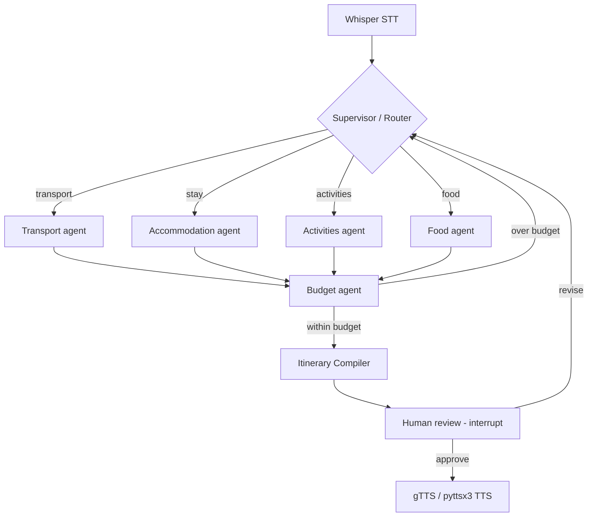

# Multi-Agent Travel Itinerary Audio Bot — Live Guided Project Plan

> **What this is:** A curriculum + architecture design doc for evolving the existing
> single-LLM *Itinerary Audio Bot* into a **multi-agent system** built with **LangGraph**,
> delivered in the same *live guided project* format as the current course.
>
> **Decisions locked for this plan:** keep the Travel Itinerary problem statement · keep
> the full voice layer (speech-in + speech-out) · this document is the plan that precedes any code.

---

## 1. Why the existing problem statement works

A travel itinerary planner is a canonical multi-agent use case: it splits cleanly into
**specialists** (transport, stay, activities, food, budget), it needs a **coordinator** to
route work, and it ends with a **synthesis** step. That is precisely the shape LangGraph
teaches. We reuse the hard, already-built parts (audio + UI) and make the *agent
orchestration* the new teaching content.

**Reused as-is (the "shell"):** Whisper speech-to-text · Gradio chat UI with mic · gTTS /
pyttsx3 text-to-speech · audio processing (librosa/pydub/ffmpeg) · Poetry env.

**Replaced (the "brain"):** the single OpenAI call + `travel_bot_context.txt` becomes a
**LangGraph `StateGraph`** of cooperating agents.

---

## 2. Target architecture

```
  🎤  Voice in
      │  Whisper STT  (REUSED)
      ▼
  ┌─────────────────────────── LangGraph StateGraph (NEW) ───────────────────────────┐
  │                                                                                   │
  │                         ┌──────────────┐                                          │
  │            ┌──────────► │  SUPERVISOR  │ ◄─────────── conditional routing         │
  │            │            │   (router)   │                                          │
  │            │            └──────┬───────┘                                          │
  │            │     ┌─────────────┼───────────────┬───────────────┐                  │
  │            │     ▼             ▼               ▼               ▼                  │
  │            │  Transport    Accommodation    Activities       Food                 │
  │            │   agent          agent           agent          agent                │
  │            │     │             │               │               │                  │
  │            │     └─────────────┴──────┬────────┴───────────────┘                  │
  │            │                          ▼                                           │
  │            │                    Budget agent  (validates/trims)                   │
  │            │                          │                                           │
  │            └──────────────────────────┤  (loop back if over budget / missing)     │
  │                                        ▼                                           │
  │                            Itinerary Compiler agent  (synthesis)                  │
  │                                        │                                           │
  │                              ⏸  Human-in-the-loop review (interrupt)               │
  │                                        │                                           │
  └────────────────────────────────────────┼──────────────────────────────────────────┘
                                            ▼
                                  gTTS / pyttsx3 TTS  (REUSED)
                                            ▼
                                       🔊  Voice out
```

### Mermaid version (for slides / docs)



### Shared state (the spine of the graph)

```python
from typing import Annotated, TypedDict
from operator import add

class ItineraryState(TypedDict):
    user_request: str               # transcribed voice query
    destination: str
    days: int
    budget: float
    preferences: list[str]          # "beach", "vegetarian", ...
    transport: dict                 # filled by Transport agent
    accommodation: dict             # filled by Accommodation agent
    activities: Annotated[list, add]  # accumulated across agents (reducer)
    food: Annotated[list, add]
    running_cost: float
    draft_itinerary: str            # Compiler output
    needs_revision: bool            # drives the budget/review loops
    messages: Annotated[list, add]  # agent scratchpad / tool history
```

---

## 3. Package layout (extends the existing `genai_voice` module)

```
genai_voice/
├── bots/              # (existing) chatbot entry kept for comparison/back-compat
├── processing/        # (existing) audio.py — STT/TTS, REUSED unchanged
├── models/            # (existing) open_ai.py — LLM client, REUSED
├── moderation/        # (existing) response filtering, REUSED
│
├── state.py           # NEW  ItineraryState schema (above)
├── tools/             # NEW  real tools each agent can call
│   ├── web_search.py      #   Playwright-backed lookups (already a dep!)
│   ├── weather.py         #   weather lookup to inform activities
│   └── budget.py          #   deterministic cost math
├── agents/            # NEW  one file per specialist
│   ├── supervisor.py
│   ├── transport.py
│   ├── accommodation.py
│   ├── activities.py
│   ├── food.py
│   ├── budget_agent.py
│   └── compiler.py
└── graph/             # NEW  the LangGraph wiring
    ├── build_graph.py     #   StateGraph nodes + edges + checkpointer
    └── runner.py          #   invoke graph from the Gradio shell

app/
└── chatbot_gradio_runner.py   # (existing) calls graph/runner.py instead of single LLM
```

### Dependencies to add to `pyproject.toml`

```toml
langgraph = "^0.2"
langchain-core = "^0.3"
langchain-openai = "^0.2"
# (langchain-community already present; playwright already present)
```

---

## 4. Live guided session breakdown

Same cadence as the existing course: each session ends with a **runnable checkpoint** the
learner can demo. Concepts are introduced *just-in-time*, then immediately applied to the
travel bot.

| # | Session | LangGraph / orchestration concept taught | Build deliverable (checkpoint) |
|---|---------|------------------------------------------|--------------------------------|
| **0** | **Setup & recap** | What "agentic" means vs a single LLM call | Reconstitute base audio bot; add `langgraph` deps; verify Gradio + voice round-trip still works |
| **1** | **LangGraph fundamentals** | `StateGraph`, nodes, edges, `START`/`END`, state reducers | One **single ReAct agent** that answers a travel query end-to-end inside a graph |
| **2** | **From one agent to many** | **Supervisor / router** pattern, conditional edges, handoff | Supervisor routes a request to a stubbed specialist; learner sees routing decisions |
| **3** | **Tool-using specialists** | Tool-calling agents, binding tools, `ToolNode` | Transport / Accommodation / Activities / Food agents with **real** web + weather + budget tools |
| **4** | **Parallel orchestration** | Fan-out / fan-in (map-reduce), parallel nodes, the Budget validation loop | Specialists run in parallel → Budget agent trims → **Compiler** synthesizes a day-by-day plan |
| **5** | **Control & memory** | **Human-in-the-loop** (`interrupt`), **checkpointer** memory, multi-turn | "Review & approve" gate before TTS; follow-ups ("suggest vegetarian restaurants") keep context |
| **6** | **Voice integration & capstone** | Wiring a graph behind a real UI; observability | Full **voice → multi-agent → voice** bot in Gradio; capstone demo + retro |

### Per-session detail

**Session 0 — Setup & recap**
- Recap the existing pipeline; name exactly which pieces stay vs change.
- Add LangGraph deps; `poetry lock && poetry install`.
- *Concept:* single-call LLM vs an agent that plans + acts in a loop.
- *Checkpoint:* the existing voice bot still runs; learner can speak and hear a reply.

**Session 1 — LangGraph fundamentals**
- Introduce `StateGraph`, `TypedDict` state, nodes as functions, edges, reducers.
- Build ONE agent node that takes the transcript and produces an itinerary string.
- *Checkpoint:* `graph.invoke({...})` returns a plan; learner can trace state changes.

**Session 2 — Supervisor / router**
- Add a supervisor node that inspects the request and emits a routing decision.
- Teach **conditional edges** and the handoff pattern.
- *Checkpoint:* logs show the supervisor choosing which specialist to call.

**Session 3 — Tool-using specialists**
- Build the four specialists; each binds real tools (`web_search`, `weather`, `budget`).
- Teach `ToolNode`, tool schemas, and why tools make agents genuinely distinct (not "one LLM in costumes").
- *Checkpoint:* each agent returns grounded, tool-derived results.

**Session 4 — Parallel orchestration + synthesis**
- Fan the four specialists out in parallel; fan-in to the **Budget agent**.
- Add the over-budget loop back to the supervisor; then the **Compiler** writes the final plan.
- Teach map-reduce-style parallelism and reducer-based state accumulation.
- *Checkpoint:* a complete day-by-day itinerary assembled from parallel agents.

**Session 5 — Human-in-the-loop + memory**
- Add an `interrupt()` so the user reviews/approves the draft before it is spoken — this maps
  directly onto the existing "edit transcript / review plan" UX.
- Add a checkpointer so follow-up turns ("suggest vegetarian restaurants") reuse state.
- *Checkpoint:* approve/revise gate works; multi-turn conversation retains the trip context.

**Session 6 — Voice integration & capstone**
- Replace the Gradio runner's single-LLM call with `graph/runner.py`.
- Keep Whisper STT and TTS unchanged at the edges.
- Add light observability (print/trace the agent path) for demos.
- *Checkpoint / capstone:* full spoken request → multi-agent plan → spoken answer, demoed live.

---

## 5. Concept coverage map (what the learner walks away knowing)

| Multi-agent / LangGraph concept | Where taught | Travel feature that makes it concrete |
|---|---|---|
| StateGraph + shared state + reducers | S1 | The itinerary built up across agents |
| Supervisor / router orchestration | S2 | Picking the right specialist per request |
| Tool-calling agents | S3 | Web/weather/budget lookups |
| Parallel fan-out / fan-in (map-reduce) | S4 | Transport+stay+activities+food at once |
| Validation / cyclic loops | S4 | Over-budget → re-plan loop |
| Synthesis / aggregator agent | S4 | Day-by-day compiler |
| Human-in-the-loop (`interrupt`) | S5 | Approve/revise before speaking |
| Memory / checkpointing / multi-turn | S5 | Follow-up questions keep context |
| Embedding a graph in a real app | S6 | Voice + Gradio shell |

---

## 6. Risks & mitigations

| Risk | Mitigation |
|---|---|
| **Base source code is missing** from the folder today (only template + PDF remain) | Session 0 reconstitutes it from the project zip (per the Antigravity PDF) or rebuilds the minimal shell |
| **"Orchestration theater"** — agents that are really one LLM in disguise | Session 3 gives each agent *real, distinct tools*; grade on tool use, not just prompts |
| **API cost / rate limits** during a live session | Use small models for specialists, cache web results, allow a mock-tools mode for teaching |
| **Voice flakiness** distracts from the agent lesson | Keep the existing text box fallback; voice is the shell, agents are the lesson |
| **LangGraph version drift** | Pin versions in `pyproject.toml`; note the exact API in the guide |

---

## 7. Stretch goals (optional, post-capstone)

- Add a **Weather-aware re-planner** that swaps outdoor activities on rainy days.
- Add an **evaluator/critic agent** that scores the itinerary and triggers a revision loop.
- Swap the supervisor for a **LangGraph "swarm"** (agents hand off peer-to-peer) to contrast patterns.
- Persist checkpoints to disk/DB so a trip plan survives across sessions.

---

## 8. Open questions to resolve before coding

1. **Tools depth:** real web/weather APIs, Playwright scraping, or a mock-tools mode for class? (affects S3)
2. **Model choice per agent:** one model for all, or cheap models for specialists + stronger model for the compiler?
3. **Session length & count:** is the 7-session (0–6) shape right for your live format, or compress to 4–5?
4. **Keep the Antigravity setup layer** as the "how to run" guide, or document a plain Poetry/venv path?

---

*Next step after you approve this plan: I scaffold the `state.py`, `tools/`, `agents/`, and
`graph/` modules and wire the first runnable checkpoint (Session 0–1).*
